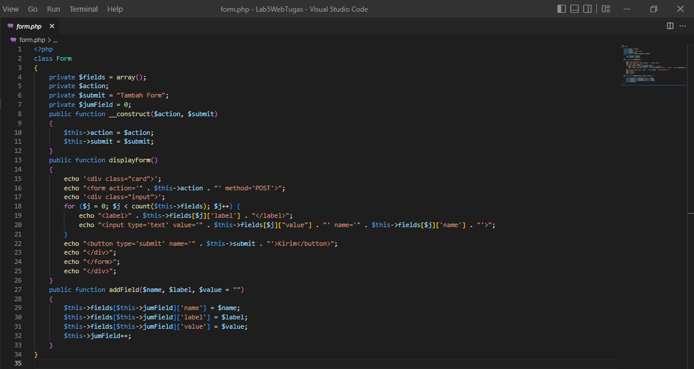
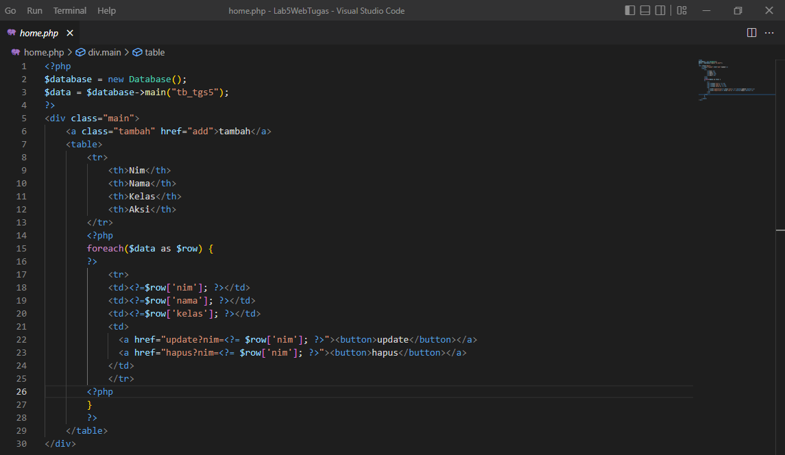

## Praktikum 5: PHP MODULAR

Nama: Alvina Damayanti

Nim: 312110125

Kelas: TI.21.A.3

## Membuat file baru dengan nama mobil.php

## Clas Library

## Contoh class library untuk membuat form

Membuat file baru dengan nama form.php

## Contoh implementasi pemanggilan class library form.php

1. Membuat file baru dengan nama form_input.php

2. Untuk database connection dan query, buat file dengan nama database.php

## Tmpilan output

## Tampilan Database

## TUGAS

Implementasikan konsep modularisasi pada kode program pada praktukum sebelumnya dengan menggunakan class library untuk form dan database connection.

## Langkah-Langkah

1. Buat folder baru dengan nama bebas; contoh Lab5WebTugas pada docroot webserver (htdocs)

2. Buat file baru dengan nama .htaccsess

3. Buat file baru dengan nama index.php

4. Buat file baru dengan nama config.php

5. Buat file baru dengan nama database.php

6. Buat file baru dengan nama add.php

7. Buat file baru dengan nama form.php

8. Buat file baru dengan nama header.php

9. Buat file baru dengan nama footer.php

10. Buat file baru dengan nama home.php

11. Buat file baru dengan nama about.php

12. Buat file baru dengan nama contact.php

13. Buat file baru dengan nama update.php

14. Buat file baru dengan nama hapus.php

## Output

Tampilan Home

Tampilan About

Tampilan Contact

Tampilan Tambah

Tampilan Update

